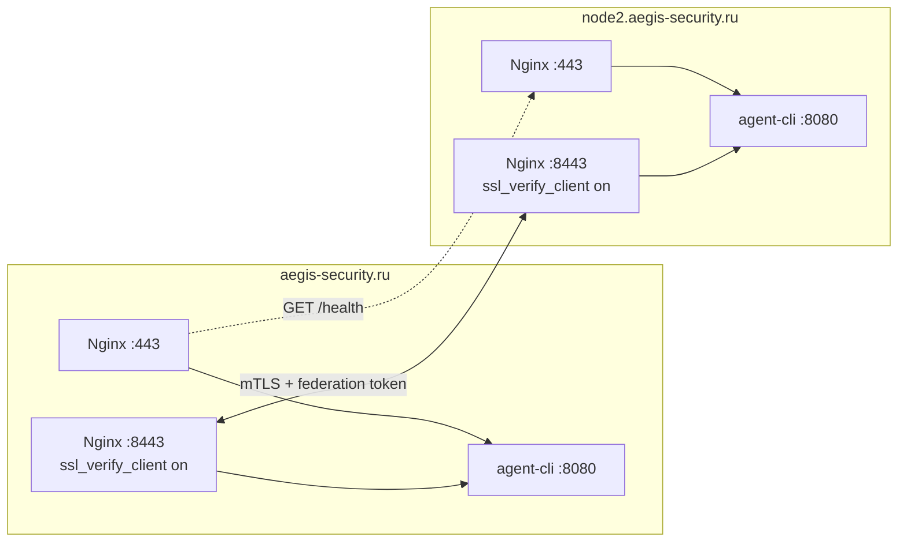

# Архитектура AEGIS

## Общая структура

```text
frontend/          # Next.js 14 + Tailwind + Framer Motion
├── app/
│   ├── dashboard/ # War Room интерфейс
│   └── page.tsx   # Лендинг
backend/           # Rust (Tokio + Axum + gRPC)
├── src/agent/     # Основная логика
│   ├── react_engine.rs
│   ├── critic_agent.rs
│   ├── fusion_engine.rs
│   ├── healing_orchestrator.rs
│   └── ...
src-tauri/         # Десктопное приложение
```

## Ключевые компоненты

### 1. Federation Layer
- P2P Discovery (Multicast)
- Дельта-синхронизация
- Merkle Root + Conflict Resolution
- **Два порта на каждой ноде:**
  - `:443` — публичный HTTPS (Let's Encrypt), health + dashboard
  - `:8443` — только `/federation/*`, обязательный client mTLS (отдельный Federation CA)
- Токен `X-AEGIS-Federation-Token` поверх mTLS между нодами



### 2. Self-Healing 2.0
- Healing Orchestrator + Formal Verification
- Частичная автономия (Low/Medium риски)
- Rollback Manager

### 3. Moving Target Defense + Advanced Deception
- Динамическая мутация fingerprint
- Автономное развёртывание honeypots
- Canary Tracking + авто-эскалация

### 4. Distributed Oracle (Raft) — production note
- **HA федерации в проде:** Merkle sync + mTLS `:8443` + health peers (см. Federation Layer).
- **Raft в UI/API:** ops-plane / индексация sync; при длительном простое heartbeats могут быть `stale` — это **не** автоматический failover кластера.
- Для пилота и SLA не обещайте «настоящий Raft consensus» без отдельного кворума ≥3 нод.

### 5. Verification
- AST Analysis
- Taint Tracking
- E2E-тесты

## Технологический стек

- **Язык:** Rust
- **Фронтенд:** Next.js 14 + TypeScript + Tailwind
- **База данных:** SQLite + Qdrant (векторная)
- **API:** Axum (HTTP) + Tonic (gRPC)
- **Десктоп:** Tauri
- **Деплой:** Vercel (фронтенд) + свой сервер (бэкенд)