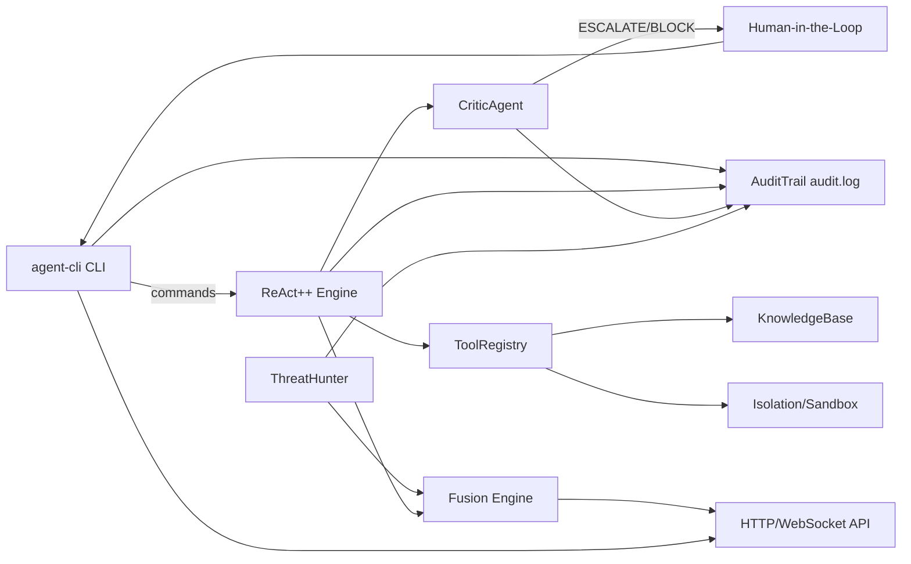

## Архитектура (Pilot)

### Компоненты
- **agent-cli (Rust / Axum)**: основной рантайм агента, CLI-команды, HTTP/WebSocket API.
- **Config Layer**: YAML + env `AEGIS_` + CLI, явный Air-Gapped режим.
- **Local LLM Client**: Ollama/vLLM (OpenAI-compatible `/v1/chat/completions`).
- **ReAct++ Engine**: цикл рассуждения/действия, инструменты, MCTS-ранжирование.
- **CriticAgent**: оценка риска/полезности, Kill Switch, эскалация при \(risk>0.8\).
- **ToolRegistry**: контролируемый набор инструментов; в Air-Gapped сетевые инструменты отключены.
- **Fusion Engine**: корреляция событий и IOC (стриминг).
- **Threat Hunter**: сбор находок (в Air-Gapped — offline findings).
- **Immutable Audit Trail**: append-only `audit.log` + hash-chain.

### Поток данных (упрощённо)

### Границы доверия (Zero-Trust)
- **LLM** рассматривается как недоверенный компонент (потенциально вредоносный вывод).
- Все “опасные” решения должны:
  - проходить оценку Critic,
  - при высоком риске требовать подтверждение человека,
  - фиксироваться в неизменяемом аудите.

